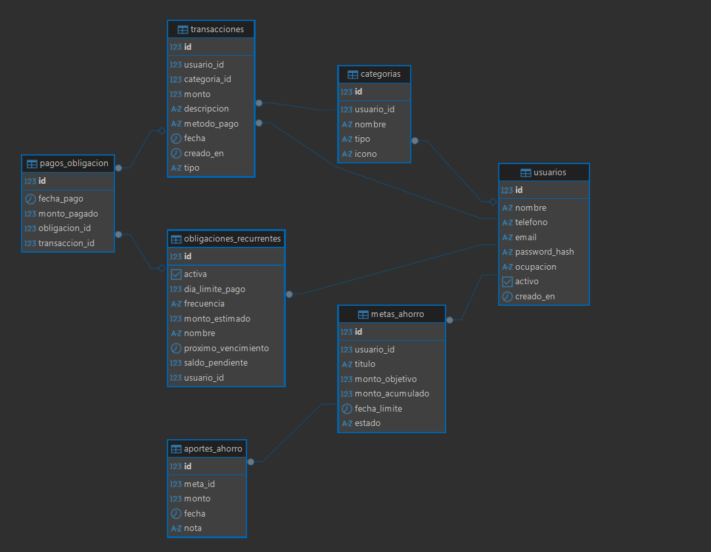

#  FinanApp Informal - Backend API

> Asistente de finanzas y gestión de flujo de dinero para trabajadores independientes e informales.
> Proyecto desarrollado con **Java 21, Spring Boot 3 y PostgreSQL**.

---

##  Contexto del Problema
En América Latina y Colombia, más del 50% de los trabajadores laboran en la informalidad (mototaxistas, repartidores, vendedores independientes, artesanos) con ingresos variables y no fijos diariamente.

Las aplicaciones bancarias tradicionales asumen nóminas fijas mensuales, dejando por fuera a este grupo de trabajadores frente a la falta de planeación financiera y el sobreendeudamiento informal ("paga diario"). **FinanApp** está diseñada para registrar operaciones financieras en segundos y calcular reservas dinámicas de ahorro y pagos fijos a partir de ingresos variables.

---

## Stack Tecnológico
* **Lenguaje:** Java  17
* **Framework:** Spring Boot 4.1
* **Persistencia:** Spring Data JPA / Hibernate
* **Base de Datos:** PostgreSQL
* **Documentación de API:** Springdoc OpenAPI (Swagger UI)
* **Gestor de dependencias:** Maven
* **Control de versiones:** Git & GitHub Flow

---

##  Estilo Arquitectónico y Buenas Prácticas
* **Arquitectura en Capas (Layered Architecture):** Separación estricta de responsabilidades entre Controlador , Servicio y Repositorio .
* **Desacoplamiento con DTOs (Data Transfer Objects):** Uso de Java records para proteger el dominio y evitar la sobreexposición de entidades de base de datos hacia la API pública.
* **Principios SOLID:** Inyección de dependencias por constructor mediante Lombok (@RequiredArgsConstructor) y clases con responsabilidad única.
* **Integridad Transaccional:** Control de transacciones ACID mediante @Transactional y operaciones de lectura optimizadas (readOnly = true).
##  Modelo de Datos (Diagrama Entidad-Relación)


---

##  Endpoints del Módulo Usuarios

| Método | Endpoint | Descripción                                                           | Código HTTP |
| :--- | :--- |:----------------------------------------------------------------------| :--- |
| `POST` | `/api/usuarios` | Registra un nuevo usuario con validaciones de teléfono y email únicos | `201 Created` |
| `GET` | `/api/usuarios/{id}` | Consulta el perfil del usuario                                        | `200 OK` |
| `PATCH` | `/api/usuarios/{id}` | Actualización parcial (nombre y/o ocupación)                          | `200 OK` |
| `DELETE` | `/api/usuarios/{id}` | Desactivación de cuenta eliminancion logica (*Soft Delete*)           | `204 No Content` |
---
### Ejemplo de Petición (`POST /api/usuarios`)
```json
{
  "nombre": "Carlos Pérez",
  "telefono": "3001234567",
  "email": "carlos.perez@example.com",
  "password": "claveSegura123",
  "ocupacion": "Mototaxista"
}
```
### Ejemplo de Respuesta Exitosa (HTTP 201 Created)
```json
{
  "id": 1,
  "nombre": "Carlos Pérez",
  "telefono": "3001234567",
  "email": "carlos.perez@example.com",
  "ocupacion": "Mototaxista",
  "activo": true,
  "creadoEn": "2026-09-29T21:05:00"
}
```
---

## COmo Ejecutar y Probar la API

### Prerrequisitos:
* **Java 21** (JDK) instalado.
* **PostgreSQL** corriendo en el puerto 5432 con una base de datos creada llamada **finanapp_db**.

### Pasos:
1. Clonar el repositorio:
   ```
   git clone https://github.com/TU_USUARIO/finanapp-backend.git
   cd finanapp-backend
   ```
2.Configurar credenciales en el archivo src/main/resources/application.properties:

    spring.datasource.url=jdbc:postgresql://localhost:5432/finanapp_db
    spring.datasource.username=tu_usuario
    spring.datasource.password=tu_contraseña
    server.port=8081

3.Iniciar la aplicación desde la terminal (bash):

    ./mvnw spring-boot:run

4.Probar la API en Swagger UI (Documentación interactiva):
    Abre en tu navegador:  http://localhost:8081/swagger-ui/index.html

## Autor
* **Navid Lobato** - Estudiante de Ingeniería de Software, Universidad de Cartagena.
